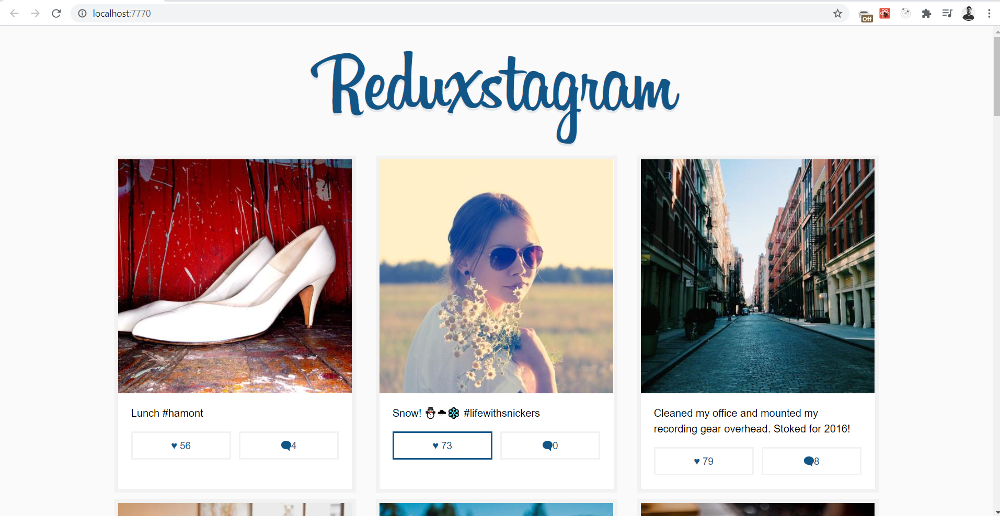
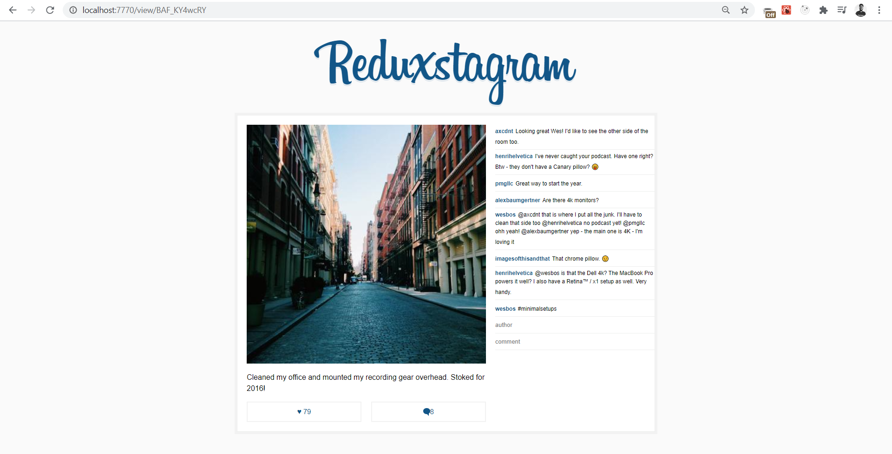

# Learn Redux

A simple React + Redux implementation. 

## Getting Started

Fork or download this repo and run `npm install` in the `learn-redux` folder with the `package.json` file.

## Features

* Like the post
* Comment on the post
* Delete the comment

## Technolgies used
 
 * React
 * Redux
 * Webpack
 * NodeJs

## Running

First `npm install` to grab all the necessary dependencies. 

Then run `npm start` and open <localhost:7770> in your browser.

## Production Build

Run `npm build` to create a distro folder and a bundle.js file.

## FAQ / Help

**Before anything**, make sure you are on the latest node. You can run `node -v` and if you have anything less than `5.x`, you'll need to update. The files will probably work on older versions, but in my experience 80% of issues go away with an update.

### Q: I'm getting: _warning.js:44 Warning: Main: `ref` is not a prop. Trying to access it will result in `undefined` being returned. If you need to access the same value within the child component, you should pass it as a different prop._

**A:**: I haven't looked into why I didn't get this error, but it means that you should not pass down `key` or `ref` because those are props that are tied and unique to each element. For now, there is a [nice fix posted here](https://github.com/wesbos/Learn-Redux-Starter-Files/issues/6#issuecomment-222210005)

### Q: I'm getting Unexpected Token Error

**A:** You probably don't have the `.babelrc` file in your `learn-redux` folder. This makes sure that you have all the right transpile dependencies. [Grab it from here](https://github.com/wesbos/Learn-Redux-Starter-Files/blob/master/learn-redux/.babelrc).

### Q: How do I download these videos?

**A:** I made a video for [exactly this](https://www.youtube.com/watch?v=-eUd2k5M1B0). 

### Q: What theme and font are you using?

**A:** Cobalt2 and Operator Mono. I wrote a bit of info here → <http://wesbos.com/uses>

